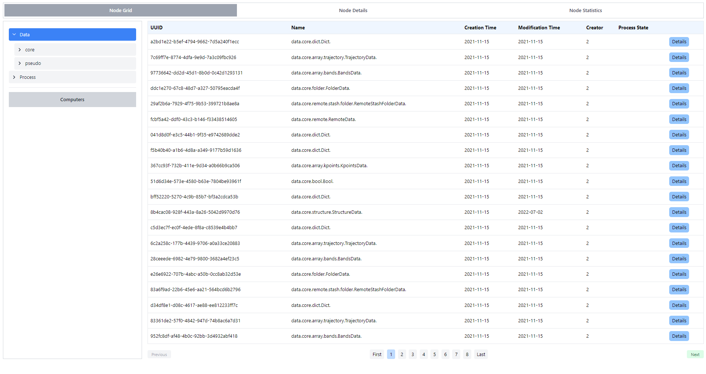
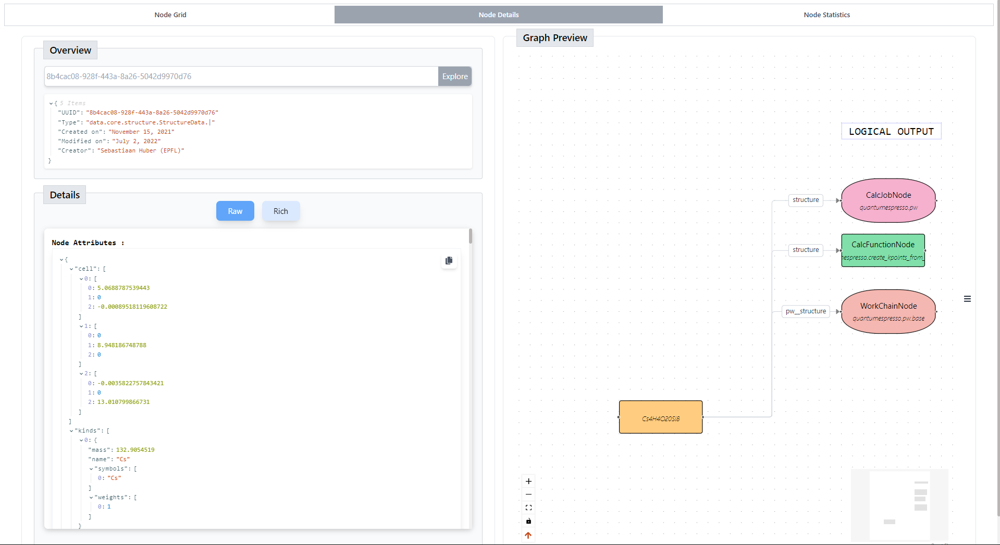
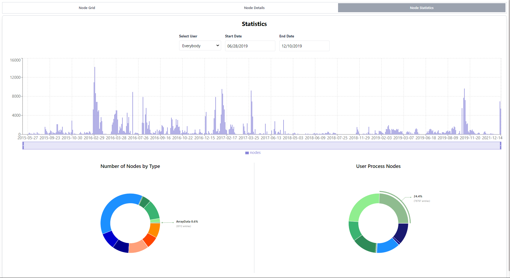

# Google Summer of Code 2024 project report

## Proposal Link
[AIIDA-GOOGLE SUMMER OF CODE 2024](https://docs.google.com/document/d/1VQOJ9eUC1KmGdjK3tjwNfsAXz1ttTVwR7MdOs2SziRA/edit?usp=sharing)

## Github Repo
[aiida-explorer](https://github.com/aiidateam/aiida-explorer)

### **Mentors:**
- **Kristjan Eimre**
- **Edan Bainglass**
- **Xing Wang**
- **Jusong Yu**

---

## **Project Overview**

The objective of this project is to develop an **intuitive tool in React** for browsing **AiiDA graphs**, effectively replacing the **outdated AiiDA Provenance Browser** currently used in **Materials Cloud Explore**. 

This new tool will interface seamlessly with AiiDA via a **REST API**, allowing users to:

- **Dynamically explore graphs.**
- **Clearly differentiate between input and output nodes.**
- **Fully visualize all connecting nodes.**
- **Preview node details without the need for page redirection.**

The end goal is to create an **AiiDA node graph viewer** that is both robust and user-friendly, which will be developed in React and potentially published as a reusable component on the npm repository**.

---

## **Key Improvements Compared to Previous Version**

- **Modernized User Interface:** 
  - Upgraded the existing interface from **AngularJS to React**, providing a more **streamlined** and **responsive experience**.

- **Enhanced Functionality:** 
  - Added new features that were missing in the previous implementation, ensuring a more **comprehensive tool for users**.

- **Increased Node Threshold:** 
  - Expanded the node display limit to handle **larger and more complex graphs effectively**.

---

## **Project Outcome**

### **Node Grid Component:**

The **Node Grid Component** lets you **select the type of Node** you want to explore. Once a type is selected, you can view all possible options available under that category.

### **Node Details Page:**

This page displays **detailed information** about the selected Node. If the selected Node has **visualization capabilities**, it can be viewed in the **Rich View**. 

- **Left Side:** Shows detailed node information.
- **Right Side:** Contains the **main graph component** which helps in visualizing the Node structure and related Nodes. They are arranged in a way that helps to **better segregate** them.

### **Statistics Section:**

The **Statistics** also contains statistics about the selected Node, providing relevant information depending on the users who created those nodes.

---

## **Future Goals**

As of now, our implementation supports the **local provenance view**. Looking ahead, we’re planning to introduce the **global provenance view**. 

This broader perspective will allow you to **visualize interconnected nodes** on a larger scale, rather than focusing solely on a **small subset of nodes**.

---
